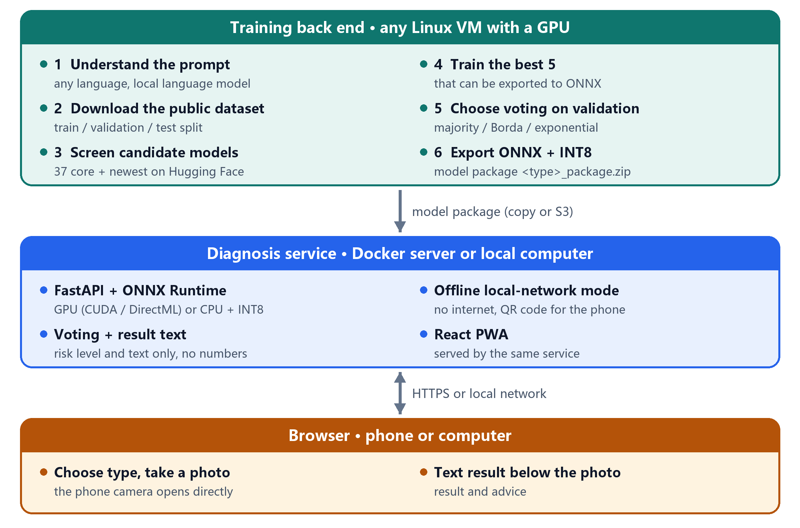
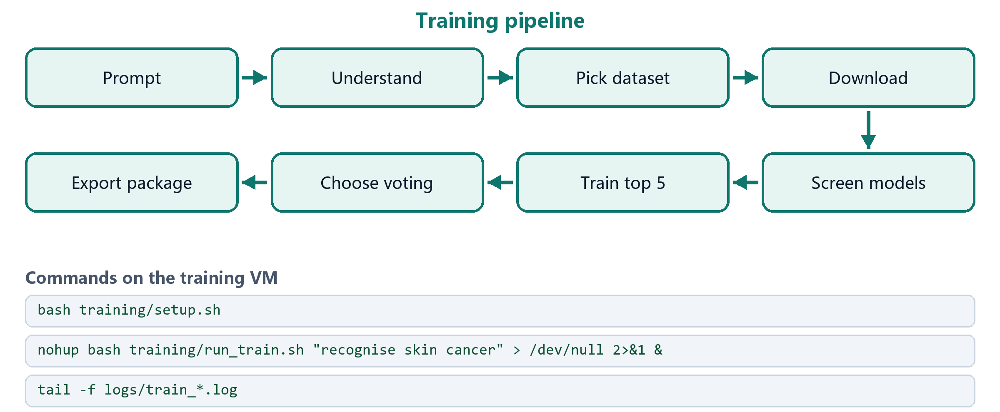
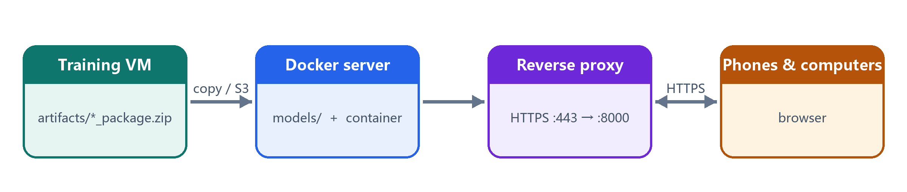
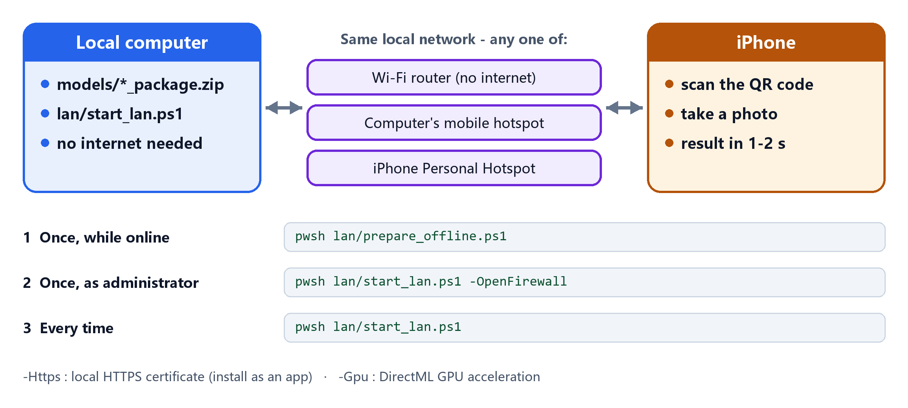
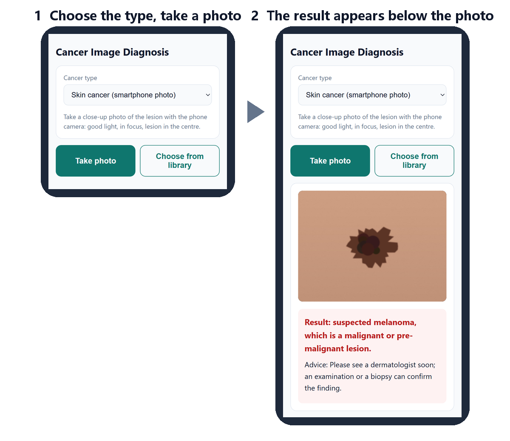
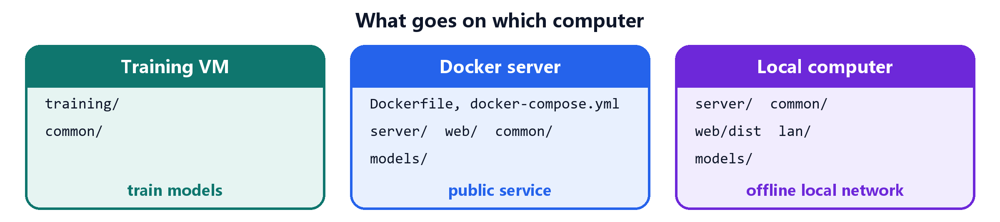

# Cancer Image Diagnosis System

 
 
 [](LICENSE.md)

Describe a cancer type **in any language** → the system picks a public dataset and the best deep-learning models,
trains a voting ensemble, and serves it to **phone and computer browsers** - on a server or on an **offline local network**.



## Features

- **Any-language prompt** - a local language model maps the request to a supported cancer type, or rejects it.
- **Automatic dataset and model choice** - 6 public datasets; 37 core models plus the newest on Hugging Face, or any model you add.
- **Voting ensemble** - majority / Borda / exponential voting chosen on validation data, with a referral threshold at 95% sensitivity.
- **Browser app** - phones and computers; the camera opens directly; the result is plain text below the photo, no numbers.
- **Offline mode** - a local computer serves phones over Wi-Fi or a hotspot with no internet; QR code to connect.
- **Fast** - GPU when available, otherwise INT8 on the CPU: 0.13-0.5 s per photo measured.

## Quick start

| I want to ... | Go to |
|---|---|
| train a model for a cancer type | [1 - Train a model](#1---train-a-model) |
| run the diagnosis service on a server | [2 - Serve on a server](#2---serve-on-a-server-docker) |
| diagnose without internet on a local network | [3 - Offline local network](#3---offline-local-network-no-internet) |
| use the app on a phone or computer | [4 - Diagnose with a phone](#4---diagnose-with-a-phone-or-computer) |

---

## 1 - Train a model

*Where:* any Linux VM with an NVIDIA GPU (16 GB+), ~50 GB disk, internet access.



| Step | What happens |
|---|---|
| Understand | a local language model (Qwen3-4B) reads the prompt; if it cannot load, the prompt is translated and matched by keywords |
| Download | the matching public dataset, split into train / validation / test (by patient or lesion where available) |
| Screen | 37 core models (incl. DINOv2/v3, SigLIP 2, ConvNeXt V2, MedSigLIP) + optional newest models; each trained briefly |
| Train | the best 5 that can be exported to ONNX, class-weighted loss, automatic batch reduction on out-of-memory |
| Choose voting | majority / Borda / exponential voting and a referral threshold, picked on the validation set |
| Export | ONNX (current PyTorch exporter), verified against PyTorch; INT8 kept only where faster → `artifacts/<type>_package.zip` |

Examples: `run_train.sh "Quiero reconocer el cáncer de piel"` · `--pool latest` · `--add_model hf:facebook/dinov2-base` ·
`--task lung --epochs 5`. Re-running resumes an interrupted run. Estimated time on a T4: ~1 h screening + 1 h training
(colorectal: use `--epochs 3`).

## 2 - Serve on a server (Docker)

*Where:* any Docker host - CPU is enough, ~2 GB RAM per model package.



```bash
cp .env.example .env                 # set ACCESS_TOKEN
mkdir -p models                      # copy *_package.zip here
docker compose up -d --build
docker compose exec diagnosis python benchmark.py   # check diagnosis time
```

Public addresses need HTTPS: put a reverse proxy / load balancer (Nginx, Caddy, AWS ALB, Azure App Gateway ...) in
front of port 8000. New model: copy the package into `models/`, then `docker compose restart`.

## 3 - Offline local network (no internet)

*Where:* a Windows / macOS / Linux computer that holds the model packages; phones on the same network.



- **Never-online computer:** run `prepare_offline.ps1 -Wheelhouse` on an online computer, copy the project folder,
  then `prepare_offline.ps1 -FromWheelhouse`. macOS / Linux: `bash lan/start_lan.sh --prepare`, then `bash lan/start_lan.sh`.
- **Install as an app (optional):** start with `-Https`; on each iPhone once, open `https://<address>/lan/ca.crt`,
  install the profile (Settings › General › VPN & Device Management), then enable it in Settings › General › About ›
  Certificate Trust Settings.
- **GPU:** `prepare_offline.ps1 -Gpu` uses DirectML (any DirectX 12 GPU); NVIDIA CUDA is picked up automatically.
- **Speed:** 0.13 s per photo (22 CPU threads), 0.5 s (4 cores), 0.17 s phone upload over local HTTPS.

## 4 - Diagnose with a phone or computer



Open the address (or scan the QR code) in Safari / Chrome / Edge / Firefox → choose the cancer type →
**Take photo** or **Choose from library**. The result appears below the photo.

| Colour | Meaning |
|---|---|
| red | suspected malignant (or cannot be ruled out) - see a doctor |
| green | most likely benign |
| yellow | uncertain - retake the photo or see a doctor |

Tips: good light, in focus, lesion in the centre. For skin photos choose **Skin cancer (smartphone photo)**.
Upload original ultrasound / histology / MRI images, not photos of a screen.

---

## Project structure

```
training/     prompt → dataset → model screening → training → voting → ONNX package   (training VM)
common/       voting methods and image preprocessing shared by training and serving
server/       FastAPI + ONNX Runtime service; lan.py = offline local-network mode; benchmark.py
web/          React + TypeScript browser app (PWA)
lan/          setup / start scripts for an offline local computer
docs/images/  diagrams and screenshots used in this README
Dockerfile, docker-compose.yml, .env.example
```



## Reference

**Supported cancer types**

| Task | Dataset (licence) | Images |
|---|---|---|
| `skin_phone` (default for skin) | PAD-UFES-20 (CC BY 4.0) | smartphone photos |
| `skin` (prompt mentions dermoscopy) | HAM10000 (CC BY-NC 4.0) | dermoscopy |
| `breast` | BreastMNIST (CC BY 4.0) | ultrasound |
| `colorectal` | PathMNIST (CC BY 4.0) | H&E histology |
| `lung` | LC25000 lung (CC BY 4.0) | H&E histology |
| `brain` | Brain Tumor MRI (CC0) | MRI |

**Training options** (`run_train.sh` / `train_system.py`)

| Option | Default | Meaning |
|---|---|---|
| `--task` | - | task id instead of a prompt |
| `--pool` | `core` | `core` (37) · `quick` (10) · `latest` (core + newest on Hugging Face) |
| `--add_model` | - | `timm:<id>` or `hf:<repo>`, repeatable |
| `--top_k` | 5 | ensemble members (fewer = faster) |
| `--epochs` | 10 | use 3 for colorectal (~90,000 images) |
| `--quantize` | `auto` | INT8 members: `auto` · `int8` · `fp32` |
| `--prompt_model` | `llm` | `llm` · `translate` · `keywords` |
| `--s3_uri` | - | also upload the package to S3 |

**Service settings** (environment variables): `ACCESS_TOKEN` (access code) · `MODELS_S3_URI` (optional S3 sync) ·
`ORT_PROVIDERS` (hardware order, default CUDA → DirectML → CPU) · `MAX_UPLOAD_MB` (15) · `CORS_ORIGINS` · `LOG_LEVEL`.

**API:** `GET /api/health` · `GET /api/tasks` · `POST /api/diagnose` (form: `task_id`, `image` → `level`, `verdict`,
`advice`) · `GET /api/docs`.

**Privacy:** photos are processed in memory only, never stored or logged; in local-network mode nothing leaves the network.
Uploads are size- and format-checked; model packages are checked for unsafe paths.

**Stack (pinned versions):** PyTorch 2.14 · timm 1.0.30 · Transformers 5.17 · ONNX Runtime 1.30 · FastAPI ·
React 19 · TypeScript 7 · Vite 8 · Docker (Node 24, Python 3.12).

## Troubleshooting

| Problem | Fix |
|---|---|
| prompt rejected | name a supported cancer type, or use `--task` |
| language model does not load | falls back to translation automatically; or `--prompt_model translate` |
| a candidate model is skipped | normal (gated, unsupported, not exportable) - see `screening.json` / `exportable.json` |
| CUDA out of memory | retried automatically with a smaller batch; stop other GPU jobs |
| phone cannot open the address | same network? run `start_lan.ps1 -OpenFirewall`; corporate Wi-Fi may block devices - use a hotspot |
| certificate warning in Safari | trust the local certificate (section 3) or start without `-Https` |
| "No models are installed" | put `*_package.zip` in `models/` and restart |
| diagnosis slower than 2 s | run `benchmark.py`; use a GPU (`-Gpu`) or train with `--top_k 3` |

## Development

```bash
cd server && pip install -r requirements.txt && MODELS_DIR=../models uvicorn app.main:app --reload   # API
cd web && npm install && npm run dev                                                                  # web app (proxies /api)
```

## Licence and acknowledgements

For **non-commercial use** under the [PolyForm Noncommercial License 1.0.0](LICENSE.md). Non-commercially licensed datasets and models (e.g. HAM10000, ConvNeXt V2, EUPE, Hiera)
are therefore included; gated models such as MedSigLIP need `HF_TOKEN` and accepted terms on Hugging Face. Each
ensemble member's licence is recorded in its model package.

Datasets: PAD-UFES-20 (Pacheco et al., 2020) · HAM10000 (Tschandl et al., 2018) · MedMNIST+ (Yang et al., 2023) ·
LC25000 (Borkowski et al., 2019) · Brain Tumor MRI (Nickparvar, 2021). Models via [timm](https://github.com/huggingface/pytorch-image-models)
and [Hugging Face Transformers](https://github.com/huggingface/transformers).
